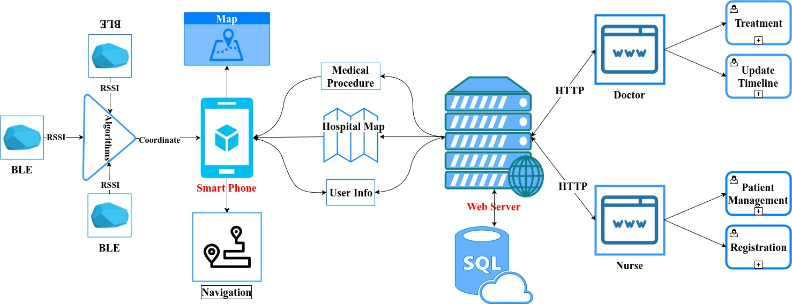

## BLE-based Hospital Positioning System (BHPS)

## Publication
* [Researchgate](https://www.researchgate.net/publication/340090598_BLE-based_Indoor_Positioning_System_for_Hospitals_using_MiRingLA_Algorithm)
* [GoogleScholar](https://scholar.google.co.in/scholar?q=BLE-based%20Indoor%20Positioning%20System%20for%20Hospitals%20using%20MiRingLA%20Algorithm)

# I. Introduction
This project is my scientific research at University of Technology. I am going to build a GPS-liked, positioning system that helps patients in wayfinding and their medical procedures. I have an ambition of bringing this system into practice at hospitals.

* We are researching to make this system as real as possible that we implement entirely the progress of patients from registrations to treatments. At first, patients can register remotely from their homes via our BHPS Android application for saving their time. **What will happens next?** When you go to the hospital, our system will detect and find you the best ways to navigate to the desired room according to your timeline.

* This project is promised to apply lots of recently-established technologies, new hardware models and techniques versus traditional ones.

* This project is under research so up to now, I have not shown the world source code. Nonetheless. this research will be completed soon in 4 months.

----
# II. Team members
 * [Phuong Le](https://github.com/PhuongLeVanHoang): **Leader, system designer, Postitioning Application**

 * [Quang Nguyen](https://github.com/nvquang97): **Web server designer**

 # III. System Model
 This is a basic initial model of our system but not the final one, we are doing a lot of research day by day to make it clear and perfect. 

  

